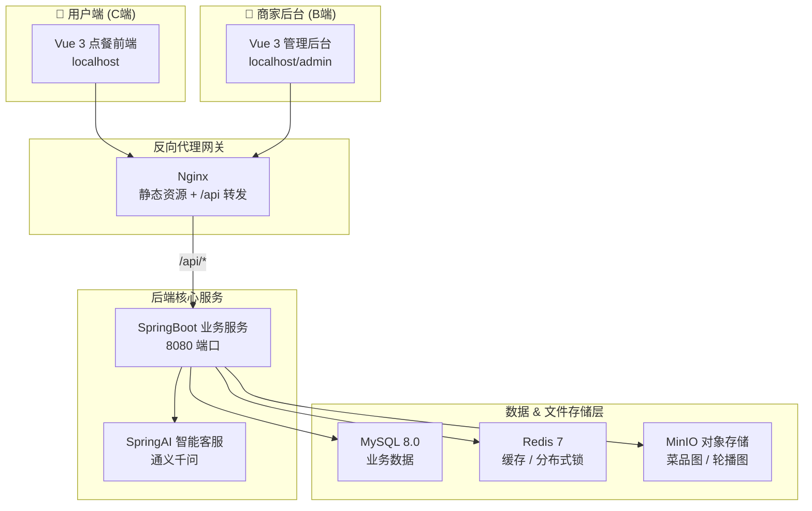
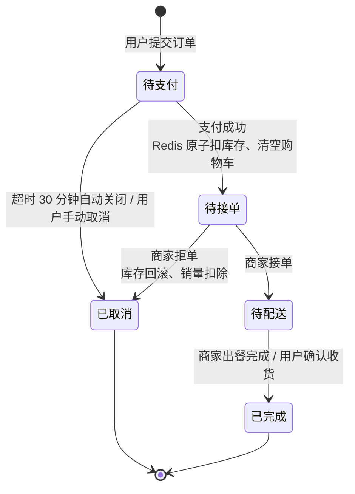

# ByteDine 字节智能餐饮（乐享美食）

> 智慧校园外卖全栈平台 —— Spring Boot 3 + Vue 3，覆盖用户点餐（C 端）、商家管理（B 端）、支付宝沙箱支付、AI 智能客服。

---

## 技术栈

| 层级 | 技术 | 版本 | 说明 |
|------|------|------|------|
| 后端框架 | Spring Boot | 3.5.16 | Java 21 开发 |
| ORM | MyBatis-Plus | 3.5.9 | 分页查询、CRUD 封装、字段自动填充 |
| 数据库 | MySQL | 8.0 | 订单、菜品、用户等业务数据持久化 |
| 缓存 | Redis | 7 | 库存缓存、下单幂等 Token、热点菜品缓存 |
| 分布式锁 | Redisson | 3.27.2 | 集群下单防并发，看门狗自动续期 |
| 认证 | JWT (jjwt) | 0.12.6 | 无状态登录鉴权，用户端/商家端隔离 |
| 密码加密 | Spring Security Crypto | — | BCrypt |
| 文件存储 | MinIO | 8.5.10 | 对象存储，存放菜品图片、轮播图 |
| AI 模块 | Spring AI + 通义千问 | 1.0.0-M6 | 在线智能客服问答 |
| 支付 | 支付宝 SDK | 4.35.79.ALL | 沙箱电脑网站支付（手动 RSA2 签名） |
| 接口文档 | Knife4j | 4.3.0 | OpenAPI 3.x 可视化文档 |
| 前端框架 | Vue 3 + Vite | Vue 3.5 / Vite 8 | Composition API 组合式开发 |
| UI 组件库 | Element Plus | 2.14 | 后台管理页面 UI |
| 反向代理 | Nginx | 1.25 | 静态资源分发、`/api` 反向代理 |
| 部署 | Docker Compose | — | 多容器编排 |

---

## 项目结构

```
lexiang-food/
├── lexiang-common/          # 公共模块（Maven）
│   ├── exception/           # 自定义业务异常
│   ├── result/              # 统一返回结果封装 Result<T>
│   └── constant/            # 公共常量
├── lexiang-server/          # 后端主服务（Maven）
│   └── src/main/java/com/lexiang/server/
│       ├── config/          # Redis / Web / MyBatisPlus / MinIO / Redisson / AI 配置
│       ├── controller/      # 接口控制器
│       │   ├── admin/       # 商家后台接口
│       │   └── user/        # 用户 C 端接口
│       ├── service/         # 业务逻辑层（含 impl/）
│       ├── mapper/          # MyBatis Mapper 接口
│       ├── entity/          # 数据库映射实体
│       ├── dto/ vo/         # 请求/响应封装
│       ├── interceptor/     # JWT 登录拦截器
│       ├── handler/         # 全局异常处理器
│       ├── aspect/          # AOP 操作审计日志
│       ├── task/            # 定时任务（超时订单关闭）
│       ├── payment/         # 支付宝沙箱支付模块
│       └── util/            # JwtUtil、AlipayUtil 等工具类
├── lexiang-web-user/        # Vue3 前端项目（双端：用户端 + 商家端）
│   └── src/
│       ├── views/user/      # 用户点餐页面
│       ├── views/admin/     # 商家管理后台页面
│       ├── layouts/         # 公共布局组件
│       ├── api/             # 后端接口请求封装
│       ├── router/          # 路由配置（前端双端路由隔离）
│       ├── stores/          # Pinia 状态管理
│       ├── composables/     # 组合式公共逻辑（语音播报等）
│       ├── utils/           # 前端工具（axios 封装等）
│       └── components/      # 公共组件（支付弹窗、AI 机器人等）
├── sql/                     # MySQL 初始化脚本
├── docker-compose.yml       # Docker 容器编排（MySQL/Redis/MinIO/Nginx）
└── README.md
```
---

## 系统架构



---

## 订单状态流转



状态码约定：`0 待支付`、`1 待接单`、`2 待配送`、`3 已完成`、`4 已取消`。

---

## 核心功能

### 用户端（C 端）
- 浏览菜品 / 分类 / 轮播图，菜品规格（辣度、份量、加料等）灵活选择
- 购物车、收货地址管理、订单提交
- 支付宝沙箱支付（PC 网站支付，轮询 + 异步回调双通道确认）
- 订单列表 / 详情 / 取消 / 确认收货
- AI 智能客服（通义千问）个性化推荐

### 商家端（B 端）
- 订单管理：接单 / 拒单 / 出餐完成，待接单订单红色高亮提醒
- 菜品 / 分类 / 规格 / 轮播图管理（MinIO 图片上传）
- 员工管理、经营数据统计大盘
- 营业状态实时开关
- 新订单 / 拒单语音提醒

### 并发与健壮性
1. **Redis Lua 脚本原子扣库存**：单条 Lua 完成「校验 + 扣减」，规避高并发超卖；
2. **Redisson 分布式锁**：支付确认 / 下单互斥，看门狗自动续期；
3. **下单幂等 Token**：Redis 校验拦截重复提交，防止重复下单；
4. **定时任务超时关单**：每分钟扫描未支付订单，超 30 分钟自动取消并归还库存；
5. **AOP 操作审计日志**：无侵入记录操作人、时间、行为；
6. **全局统一异常处理**：`@RestControllerAdvice` 统一返回格式。

---

## 快速开始

### 前置环境
- Java 21、Maven 3.8+、Node.js 20+、Docker Desktop
- MySQL 客户端（Navicat / DataGrip / DBeaver）

### 方式一：本地开发调试

> 容器只启动中间件（MySQL/Redis/MinIO/Nginx），后端在 IDEA 本地运行、前端可热更新。

```bash
# 1. 启动中间件容器
docker compose up -d

# 2. IDEA 运行后端 lexiang-server（端口 8080）

# 3. 前端开发服务器（端口 5173，热更新）
cd lexiang-web-user
npm install
npm run dev
```

访问地址：
- 用户点餐端：`http://localhost:5173/`
- 商家管理后台：`http://localhost:5173/admin/`
- 后端接口文档（Knife4j）：`http://localhost:8080/doc.html`
- MinIO 控制台：`http://localhost:9001`

### 方式二：Nginx 部署

> 前端打包进 Nginx 容器（80 端口），`/api` 反向代理到宿主机后端 8080。

```bash
# 1. 构建并启动前端 Nginx 容器
docker compose up -d --build web

# 2. IDEA 运行后端 lexiang-server（端口 8080）
```

访问地址：
- 用户点餐端：`http://localhost/`
- 商家管理后台：`http://localhost/admin/`

## 配置说明

后端配置分层：`application.yaml`（公共）+ `application-local.yaml`（本地开发）+ `application-docker.yaml`（容器化）。


| 配置 | 说明 |
|---|---|
| `spring.datasource.url` | MySQL 连接，本地开发指向 `localhost:3307`（Docker MySQL） |
| `spring.data.redis` | Redis 连接，`localhost:6379` |
| `jwt.secret` / `jwt.expiration` | JWT 签名密钥 / 有效期（当前 7 天 = 604800000ms） |
| `payment.*` | 支付宝沙箱网关、APPID、RSA2 私钥/公钥、回调地址 |
| `minio.*` | 对象存储地址与密钥 |
| `spring.ai.openai.*` | 通义千问兼容 OpenAI 配置 |
---

## 核心接口

| 请求方式 | 接口路径 | 业务说明 |
| --- | --- | --- |
| POST | /api/user/login | 用户登录 |
| POST | /api/user/register | 用户注册 |
| POST | /api/user/send-code | 发送重置密码验证码（固定 666666） |
| POST | /api/user/forgot-password | 忘记密码重置（需验证码） |
| GET | /api/category/list | 菜品分类列表 |
| GET | /api/user/dish/list | 菜品分页列表 |
| GET | /api/user/order/token | 获取下单幂等 Token |
| POST | /api/user/order | 提交订单 |
| PUT | /api/user/order/{id}/cancel | 用户取消订单 |
| PUT | /api/user/order/{id}/confirm | 用户确认收货 |
| POST | /api/user/pay/create | 生成支付宝支付页面 |
| GET | /api/user/pay/query | 轮询支付状态 |
| POST | /api/pay/notify/alipay | 支付宝异步回调（验签） |
| POST | /api/merchant/login | 商家后台登录 |
| POST | /api/merchant/send-code | 商家发送重置验证码 |
| POST | /api/merchant/forgot-password | 商家忘记密码重置 |
| GET | /api/admin/order/list | 商家订单列表 |
| PUT | /api/admin/order/{id}/accept | 商家接单 |
| PUT | /api/admin/order/{id}/cancel | 商家拒单 |
| PUT | /api/admin/order/{id}/complete | 订单出餐完成 |
| POST | /api/admin/dish | 新增菜品 |
| POST | /api/admin/upload/image | 图片上传（MinIO） |
| GET | /api/admin/spec/group/list | 菜品规格分组 |
| GET | /api/admin/statistics/dashboard | 经营数据大盘 |
| POST | /api/admin/ai/query | AI 智能客服对话 |

完整接口文档见 Knife4j：`http://localhost:8080/doc.html`。

---

## 常见问题

**Q：为什么改了前端代码，`localhost`（80 端口）看不到更新？**
A：Nginx 容器服务的是 `npm run build` 构建产物（烧进镜像的静态文件），改源码需重新 `docker compose build web && docker compose up -d web`。开发阶段用 `npm run dev`（5173 端口）即可热更新。

**Q：为什么访问 AI 接口失败？**
A：确认已配置通义千问 `AI_API_KEY`，且 `spring.ai.openai.base-url` 指向 dashscope 兼容地址 `https://dashscope.aliyuncs.com/compatible-mode`。

**Q：Docker 镜像拉取失败（`no such host`）？**
A：`C:\Users\<用户名>\.docker\daemon.json` 中 `registry-mirrors` 配置了失效的镜像源，换成可用源（如 `https://docker.m.daocloud.io`）后重启 Docker Desktop。

---

## License

个人学习/演示项目，仅供课程与开发调试使用。
